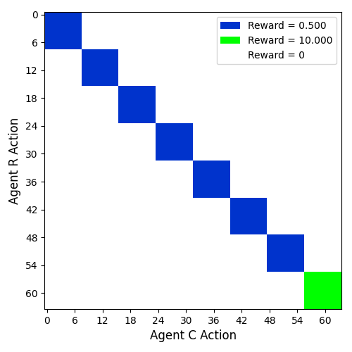

# CMG (Cooperative Matrix Game)

This module provides tools for creating and working with matrix games for multi-agent cooperation studies.

## Layout Generator

The `LayoutGenerator` class provides functionality to create various payoff matrix layouts for matrix games.

### How to use the Layout Generator:

1. Create an instance of the layout generator:
   
   ```python
   from cooperative_matrix_game.env.cmg.layout_generator import LayoutGenerator
   
   generator = LayoutGenerator()
   ```
   
2. Use existing layouts:
   
   ```python
   payoff_matrix, n_dim, centers = generator.get_payoff_matrix("cmg_s")
   ```
   
3. Create and register custom layouts:
   
   ```python
   # Option 1: Define a custom layout function
   def my_layout_func():
       M = 4
       k_m = [5, 10, 15, 20]
       r_m = [0.2, 0.4, 0.6, 0.8]
       return generator._create_layout(M, k_m, r_m)
   
   generator.register_layout("my_layout", my_layout_func)
   
   # Option 2: Use the create_custom_layout helper
   blocks_layout = generator.create_custom_layout(blocks=[(5, 0.5), (3, 1.0), (4, 2.0)])
   generator.register_layout("my_blocks", lambda: blocks_layout)
   ```
   
4. Get available layouts:
   
   ```python
   layouts = generator.get_available_layouts()
   ```

## Available Layout Types

- `diagonal`: Simple diagonal layout with fixed dimensionality
  
  

- `cmg_s`: CMG with equal block sizes, rewards scaling from 0.5 to 1.0
  
  

- `cmg_needle`: CMG with equal blocks, last block has high reward (needle in haystack)
  
  

- `cmg_needle_h`: CMG needle with smaller high-reward final block
  
  

- `cmg_h`: Hierarchical CMG with increasing block sizes, equal rewards
  
  

- `cmg_ht`: Hierarchical CMG with increasing sizes, rewards inversely proportional
  
  

- `cmg_s_suboptimal`: Multiple maxima and minima

  